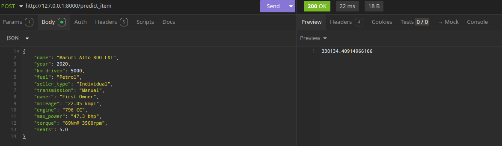
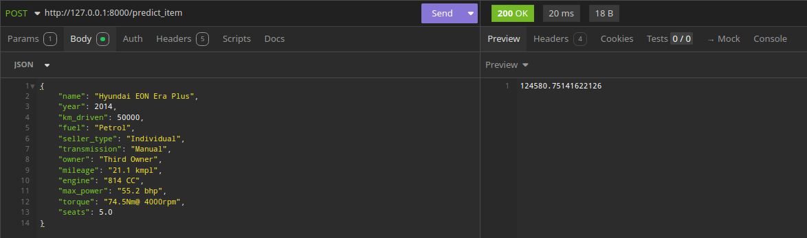
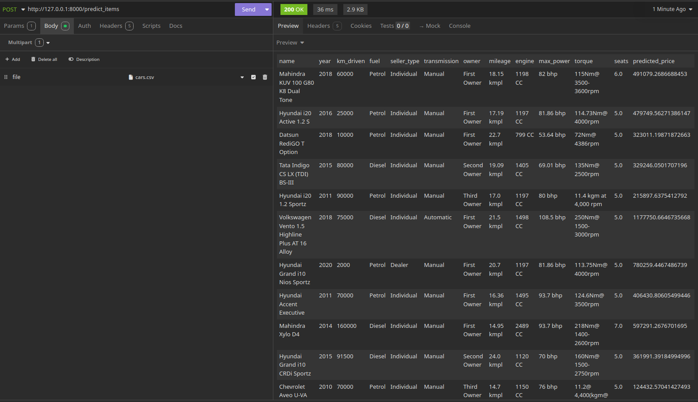

# Домашнее задание №1: Регрессия и веб-сервис

## Описание задания
В рамках этого задания были выполнены следующие этапы:
1. Обучение моделей регрессии для предсказания стоимости автомобилей на основе предоставленных данных.
2. Анализ и обработка данных, включая кодирование категориальных признаков, стандартизацию и обработку пропусков.
3. Подбор гиперпараметров для различных моделей регрессии, таких как Lasso, Ridge и ElasticNet.
4. Реализация веб-сервиса с использованием FastAPI для предоставления предсказаний как для единичных объектов, так и для файлов с данными.

---

## Результаты
### Модели
1. **Линейная регрессия**:
   - R² на тренировочном наборе: 0.5938
   - R² на тестовом наборе: 0.5944

2. **Lasso-регрессия**:
   - После подбора гиперпараметров с использованием GridSearchCV (10 фолдов):
     - Оптимальное значение `alpha`: 1250
     - R² на тесте: 0.593

3. **ElasticNet-регрессия**:
   - Оптимальные параметры:
     - `alpha`: 1250
     - `l1_ratio`: 1
   - R² на тесте: 0.593

4. **Ridge-регрессия c добавлением категориальных признаков**:
    - `alpha`: 1
    - R² на тесте: 0.748

### Метрики
Для оценки моделей использовались следующие метрики:
- Mean Squared Error (MSE)
- Коэффициент детерминации (R²)
- Кастомная бизнес-метрика: доля прогнозов с отклонением от реальной стоимости не более 10%. Лучшая модель достигла значения 0.233.

---

## Наибольший буст в качестве
Использование Ridge-регрессия c добавлением категориальных признаков дало наибольшее улучшение качества.

---

## Реализация веб-сервиса
Реализован веб-сервис с использованием FastAPI:
 - Метод для предсказания стоимости одного автомобиля.
 - Метод для предсказания стоимости автомобилей из загружаемого CSV-файла.
 - Результаты возвращаются в формате JSON или в виде обработанного CSV-файла.

---

## Примеры работы веб-сервиса

Также в samples/predicted_prices.scv представлен результат работы соответсвующего метода

